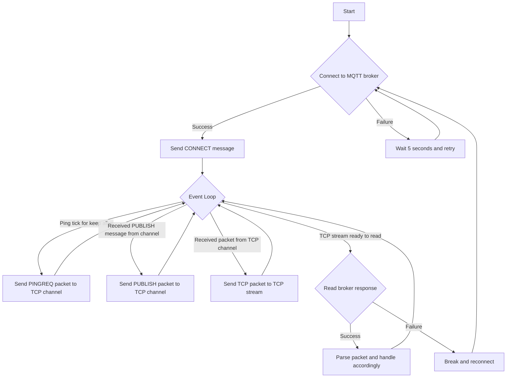

# aimeqtt

A MQTT 3.1.1 rust client.

Used as a learning ground for Rust, `tokio` and MQTT. Used in _production_ at my home for [teleinfo2mqtt-rs](https://github.com/angristan/teleinfo2mqtt-rs).

## Features

- Connect to a MQTT broker (`CONNECT`, `CONNACK`)
  - Username/password support
- Send messages (`PUBLISH`)
- Receive messages (`SUBSCRIBE`, `SUBACK`, `PUBLISH`)
- Keep alive (`PINGREQ`, `PINGRESP`)

It only supports QoS 0 for now.

## Design

The library has two main components:

- the parsing and serialization of MQTT TCP packets, which are binary-encoded
- the client itself, which handles the connection to the broker and the internal flow of messages

It is designed around an event loop using tokio's `tokio::net::TcpStream` for the TCP connection to the broker and `tokio::sync::mpsc` channels for internal communication.

Here is a questionable attempt at a flowchart:



## Usage

```rust
#[tokio::main]
async fn main() {
    let broker_host = "127.0.0.1";
    let broker_port = 1883;

    let mqtt_client_options = client::ClientOptions::new(broker_host.to_string(), broker_port)
        .with_keep_alive(60);

    let mut mqtt_client = client::new(mqtt_client_options).await;

    loop {
        mqtt_client
            .publish("foo/bar".to_string(), "Hello!".to_string())
            .expect("Failed to send message");

        tokio::time::sleep(Duration::from_secs(5)).await;
    }
}
```

## MQTT specs

I relied on the following resources to implement the MQTT packets:

- https://docs.oasis-open.org/mqtt/mqtt/v3.1.1/os/mqtt-v3.1.1-os.html
- https://public.dhe.ibm.com/software/dw/webservices/ws-mqtt/mqtt-v3r1.html
