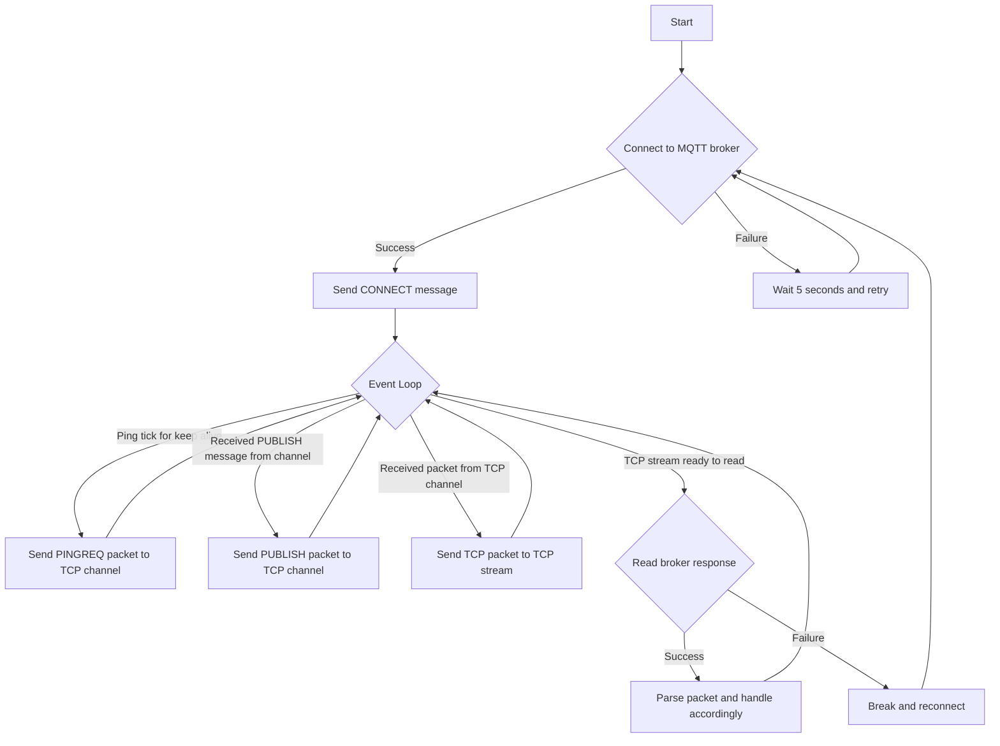

# aimeqtt

A MQTT 3.1.1 rust client.

Used as a learning ground for Rust, `tokio` and MQTT. Used in _production_ at my home for [teleinfo2mqtt-rs](https://github.com/angristan/teleinfo2mqtt-rs).

## Features

- Connect to a MQTT broker (`CONNECT`, `CONNACK`)
  - Username/password support
- Send messages (`PUBLISH`)
  - Retained messages support
- Receive messages (`SUBSCRIBE`, `SUBACK`, `PUBLISH`)
- Keep alive (`PINGREQ`, `PINGRESP`)

It only supports QoS 0 for now.

## Installation

Add this to your `Cargo.toml`:

```toml
[dependencies]
aimeqtt = { git = "https://github.com/angristan/aimeqtt" }
```

## Design

The library has two main components:

- the parsing and serialization of MQTT TCP packets, which are binary-encoded
- the client itself, which handles the connection to the broker and the internal flow of messages

It is designed around an event loop using tokio's `tokio::net::TcpStream` for the TCP connection to the broker and `tokio::sync::mpsc` channels for internal communication.

Here is a questionable attempt at a flowchart:


```mermaid
graph TB
    Start[Start] --> ConnectBroker{Connect to MQTT broker}
    ConnectBroker -->|Success| SendConnect[Send CONNECT message]
    ConnectBroker -->|Failure| Retry[Wait 5 seconds and retry]
    Retry --> ConnectBroker
    SendConnect --> EventLoop{Event Loop}
    EventLoop -->|Ping tick for keep alive| SendPingReq[Send PINGREQ packet to TCP channel]
    EventLoop -->|Received PUBLISH message from channel| SendPublish[Send PUBLISH packet to TCP channel]
    EventLoop -->|Received packet from TCP channel| SendRawPacket[Send TCP packet to TCP stream]
    EventLoop -->|TCP stream ready to read| ReadResponse{Read broker response}
    SendPingReq --> EventLoop
    SendPublish --> EventLoop
    SendRawPacket --> EventLoop
    ReadResponse -->|Success| ParsePacket[Parse packet and handle accordingly]
    ReadResponse -->|Failure| Reconnect[Break and reconnect]
    ParsePacket --> EventLoop
    Reconnect --> ConnectBroker
```

## Usage

```rust
use std::time::Duration;
use aimeqtt::client::{self, ClientOptions, PublishOptions};
use aimeqtt::ReceivedPublish;

#[tokio::main]
async fn main() {
    let options = ClientOptions::new()
        .with_broker_host("127.0.0.1".to_string())
        .with_broker_port(1883)
        .with_keep_alive(60)
        .with_callback_handler(on_message);

    let mut client = client::new(options).await;

    // Subscribe to a topic
    client.subscribe("foo/bar".to_string()).unwrap();

    // Publish a message
    client
        .publish("foo/bar".to_string(), "Hello!".to_string(), PublishOptions::default())
        .await
        .unwrap();

    // Publish a retained message
    client
        .publish("foo/bar".to_string(), "Retained!".to_string(), PublishOptions::new().retain())
        .await
        .unwrap();

    loop {
        tokio::time::sleep(Duration::from_secs(5)).await;
    }
}

fn on_message(msg: ReceivedPublish) {
    println!("Received on '{}': {} (retained: {})", msg.topic, msg.payload, msg.retain);
}
```

## MQTT specs

I relied on the following resources to implement the MQTT packets:

- https://docs.oasis-open.org/mqtt/mqtt/v3.1.1/os/mqtt-v3.1.1-os.html
- https://public.dhe.ibm.com/software/dw/webservices/ws-mqtt/mqtt-v3r1.html
